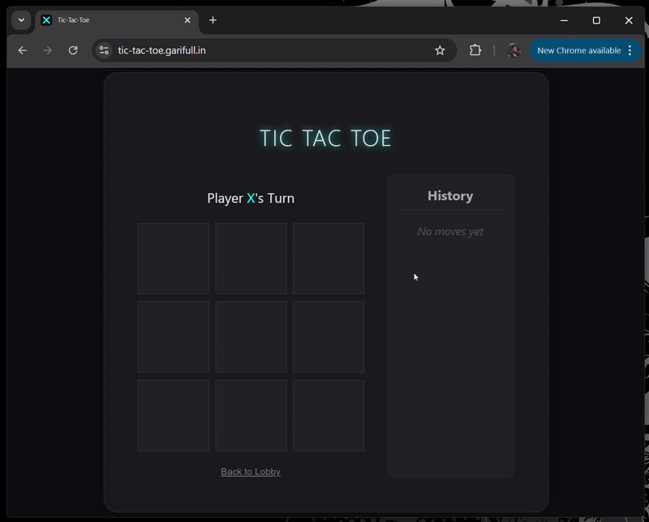

# Tic-Tac-Toe API

Serverless Tic-Tac-Toe API built with AWS Lambda and Python.

## Notes

### How to run your project (or where it is hosted)

It is hosted on AWS [https://tic-tac-toe.garifull.in/](https://tic-tac-toe.garifull.in/)

### How much time you spent building the project

Approximately I spent:
* 1 hour to build initial skeleton of the project using base python and SQLite
* 2 hours to refactor initial skeleton and tests
* 1 hour I spent on coding UI
* 1 hour to spin up the project and deploy it to AWS.

### Any assumptions you made

I decided to use AWS serverless infrastructure to host the project because it is an unusual approach for me, but I wanted to experiment with it in the scope of a simple project. Overall I tried to keep implementation as simple as possible.

### Any trade-offs you made

I would expect to have some authentication and ACL controls for accessing endpoints and games but I decided to keep it simple. Also, I omitted the fact that the number of games stored in DynamoDB might be big, so pagination is not implemented as far as it is a quick project. Also most likely it is not the best approach to store history of games in a simple array but for simplicity I thought it is worth the trade-off.

### Any special/unique features you added

I decided to add a UI despite it wasn't part of the assessment task because to me it is always important to present the project to the user as a whole working application which you can try to use within just a few clicks.

### Anything else you want us to know about

Never used AWS Lambda before so I decided to use the opportunity to learn it during the implementation of this project. Also I added GitHub Actions for tests and deployment. It is always important to me to automate as much as possible even if it is a small project.

## Feedback

Although it is a simple project, I spent a few fun hours learning how AWS CloudFormation works in real life. That was an interesting experience to try Alpine.js and CodeRabbit for code review on a small project.
